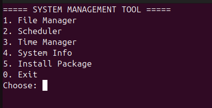

# Buildroot Shell Project

## Overview

This project is developed as part of the Linux System Programming and Buildroot course project.

The Shell Programming module provides a simple command-line System Management Tool developed using Bash Shell on Ubuntu Linux. The project demonstrates fundamental Linux administration tasks including file management, task scheduling, system information retrieval, package management, and time management.

---
## Main Interface

<p align="center">
  
</p>
## Features

### 1. File Manager

Provides basic file management operations:

* Create file
* Delete file
* Copy file
* Move file
* List files and directories
* Search files

### 2. Task Scheduler

Uses Linux Cron to automate tasks:

* View current cron jobs
* View scheduling logs
* Add scheduled tasks automatically

### 3. Time Manager

Provides time-related system information:

* Display current date and time
* Display timezone configuration

### 4. System Information

Displays system status information:

* Hostname
* Kernel version
* Operating system information
* CPU information
* Memory usage
* Disk usage
* Logged-in users

### 5. Package Management

Supports automatic software installation and removal using Ubuntu package manager.

---

## Project Structure

```text
ShellProject/
├── main.sh
├── file_manager.sh
├── scheduler.sh
├── time_manager.sh
├── system_info.sh
├── install.sh
├── README.md
└── screenshots/
```

---

## Main Menu

```text
===== SYSTEM MANAGEMENT TOOL =====

1. File Manager
2. Scheduler
3. Time Manager
4. System Info
5. Install Package
0. Exit
```

---

## Requirements

### Software

* Ubuntu Linux (Recommended)
* VMware Workstation / VMware Player
* Bash Shell
* Cron Service
* Git

### Verify Environment

```bash
bash --version
git --version
systemctl status cron
```

---

## Installation

Clone the repository:

```bash
git clone https://github.com/Thees-Anh/buildroot-shell-project.git
```

Enter project directory:

```bash
cd buildroot-shell-project
```

Grant execution permission:

```bash
chmod +x *.sh
```

Run the application:

```bash
./main.sh
```

---

## Demonstration

### File Manager

```bash
./file_manager.sh
```

### Scheduler

```bash
./scheduler.sh
```

### Time Manager

```bash
./time_manager.sh
```

### System Information

```bash
./system_info.sh
```

### Package Management

```bash
./install.sh
```

---

## Learning Outcomes

After completing this project, students are able to:

* Develop shell scripts using Bash.
* Manage files and directories in Linux.
* Automate tasks using Cron.
* Retrieve system information programmatically.
* Manage software packages in Ubuntu.
* Build modular shell-based administration tools.
* Use Git and GitHub for source code management.

---

## Author

Tran The Anh

Linux Shell Programming Module

Buildroot Course Project

---

## Repository

GitHub Repository:

https://github.com/Thees-Anh/buildroot-shell-project

